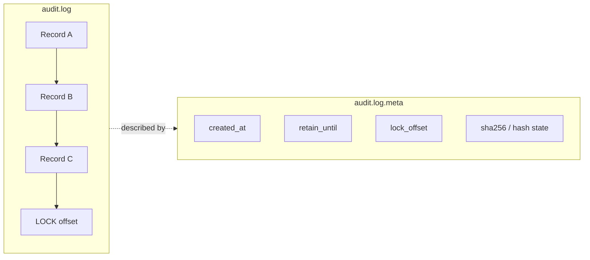
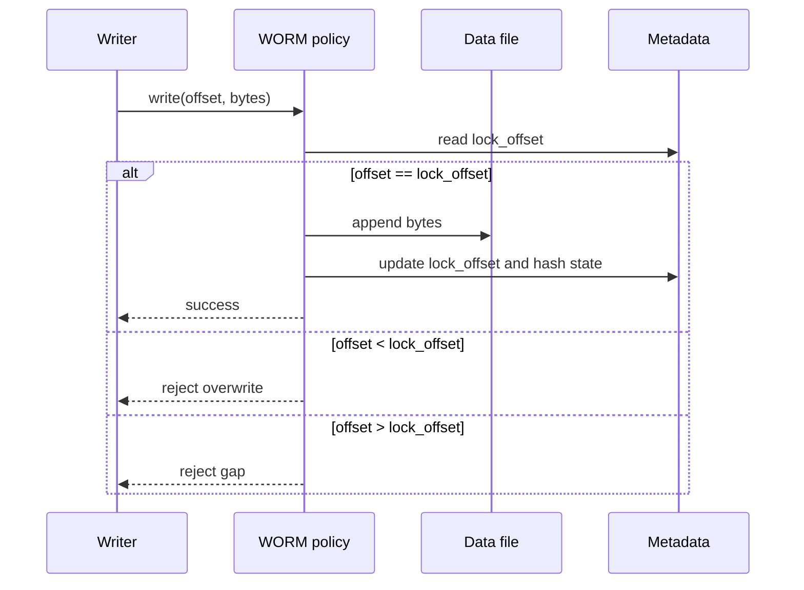
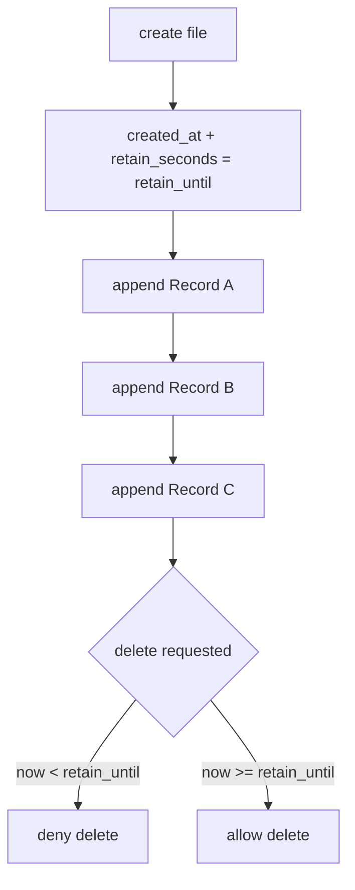
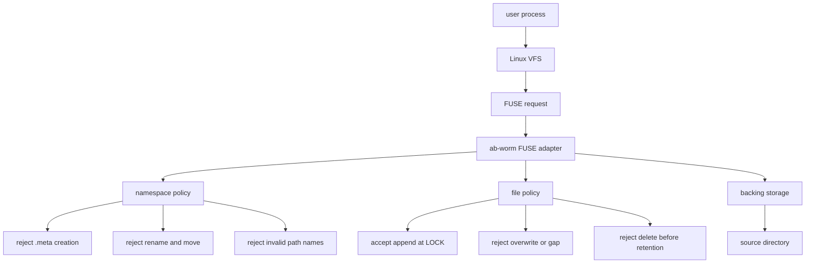
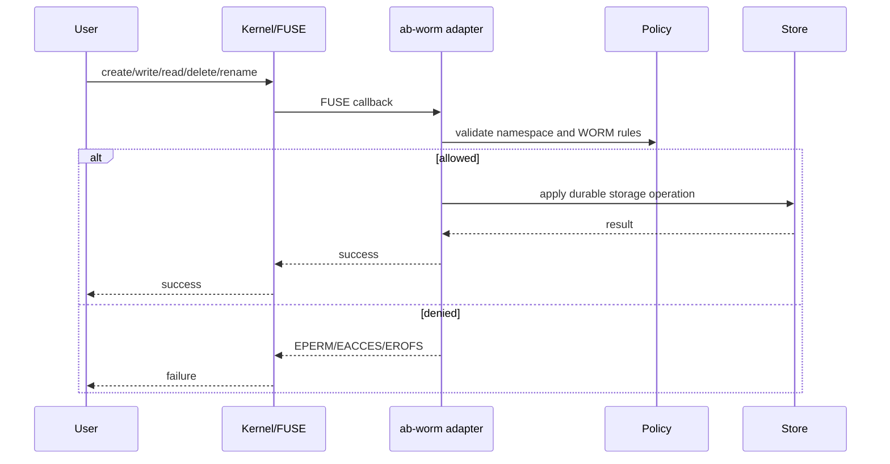

# Autobricks WORM Filesystem

Autobricks WORM is an appendable WORM (Write Once, Read Many) filesystem.
Committed bytes cannot be overwritten, while new bytes can be appended at the
current lock boundary.

The command-line executable is `ab-worm`. Current version: `0.1.7`.

## Status

- Linux: FUSE mount, storage policy, test workflow, and Debian packaging.
- macOS: FSKit code is under verification.
- Windows: planned for future development.

For Ubuntu service installation, see [INSTALL.md](INSTALL.md). For basic mounted
filesystem operation, see [HOWTO.md](HOWTO.md).

## Development Setup

Ubuntu:

```sh
sudo apt-get update
sudo apt-get install -y build-essential pkg-config fuse3
curl --proto '=https' --tlsv1.2 -sSf https://sh.rustup.rs | sh
. "$HOME/.cargo/env"
```

Clone, build, and test:

```sh
git clone https://github.com/pregene/autobricks-worm.git
cd autobricks-worm
cargo test --locked
./build.sh --release
./target/release/ab-worm --version
```

Linux mount integration test:

```sh
tests/linux-test.sh
```

The integration test builds `bin/ab-worm`, mounts `worm-storage` at
`worm-mount`, checks append-only behavior, directory behavior, metadata
protection, delete rejection during retention, and delete success with
zero-day retention.

## CLI

```sh
ab-worm --help
ab-worm --version
ab-worm mount SOURCE MOUNTPOINT --retain DAYS [--allow-other]
ab-worm unmount MOUNTPOINT
```

Example:

```sh
sudo mkdir -p /worm-storage /mnt/worm-storage
sudo ab-worm mount /worm-storage /mnt/worm-storage --retain 365 --allow-other
```

## Appendable WORM Structure

Each file has data plus a metadata record. The metadata stores the creation
time, fixed retention deadline, committed lock offset, checksum, and incremental
hash state.



Append handling:



Retention is fixed when the file is created. Appending changes `lock_offset` and
hash state, but it does not extend `retain_until`.



On Linux, retention checks use a monotonic boot clock so wall-clock changes do
not make retained files expire early.

## FUSE Policy Flow

On Linux, `ab-worm mount` opens the backing storage as root and exposes it
through a FUSE mount. Users interact with the mount point; policy checks happen
before backing files are changed.



Common request handling:



Read-only metadata is exposed as a sibling `.meta` file. Applications can read
metadata through the mount, but user writes, truncates, deletes, renames, and
manual `.meta` creation are rejected.

## Packaging

Build local Ubuntu packages:

```sh
scripts/package_deb.sh
```

Build Ubuntu 22.04 and 24.04 packages for `amd64` and `arm64` with Docker:

```sh
scripts/package_deb_docker.sh
AB_WORM_PACKAGE_IMAGE=ubuntu:24.04 AB_WORM_PACKAGE_OS_VERSION=24.04 scripts/package_deb_docker.sh
```

Generated packages are written to `build/`.

## Verification

```sh
cargo test --locked
cargo fmt --check
cargo clippy --locked --all-targets -- -D warnings
python tests/build_version.py
```

Linux FUSE tests need `/dev/fuse` and mount permission:

```sh
cargo test --locked --test fuse_namespace -- --ignored
tests/linux-test.sh
```

## Licenses

FUSE and Rust `fuser` references, component licenses, and the original MIT notice
are recorded in [THIRD_PARTY_NOTICES.md](THIRD_PARTY_NOTICES.md).

The Apple SDK, Rust/Swift runtime, WinFsp, winfsp-rs, and Dokany license review
is recorded in [Filesystem dependency licenses](docs/DEPENDENCY_LICENSES.md).
